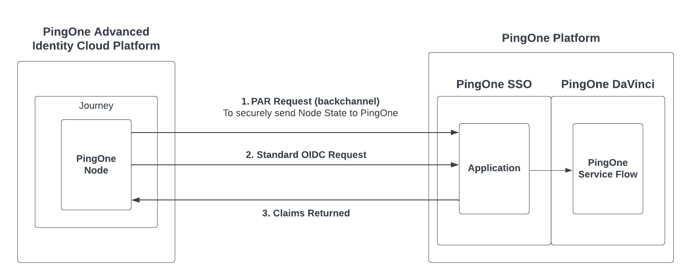
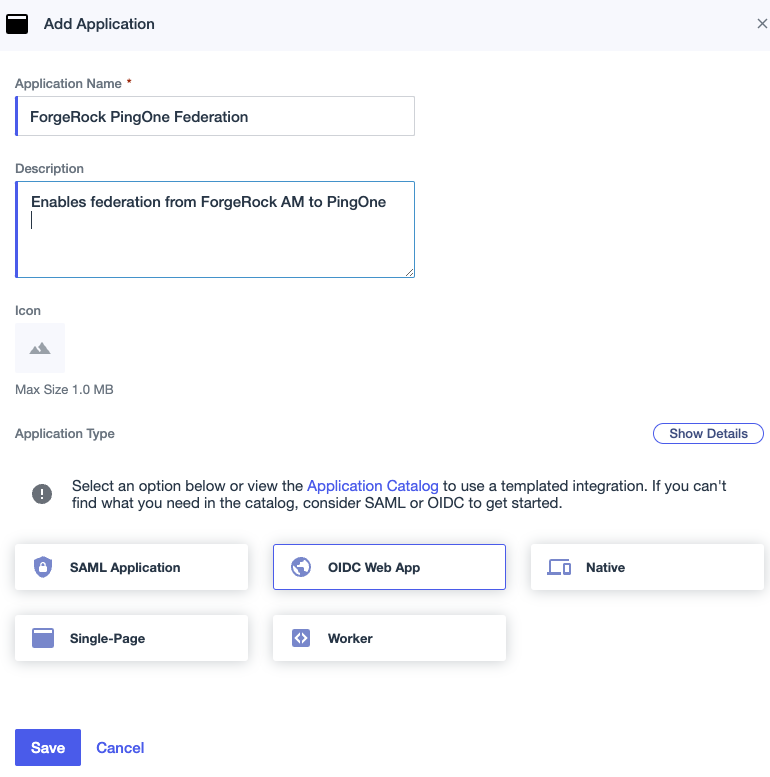
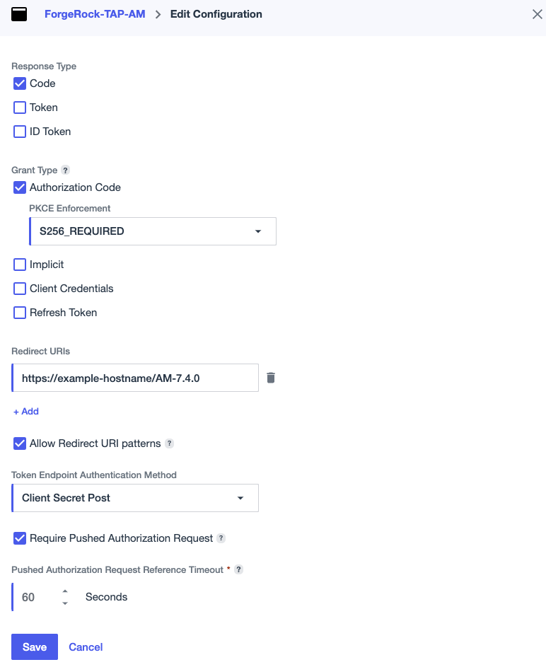
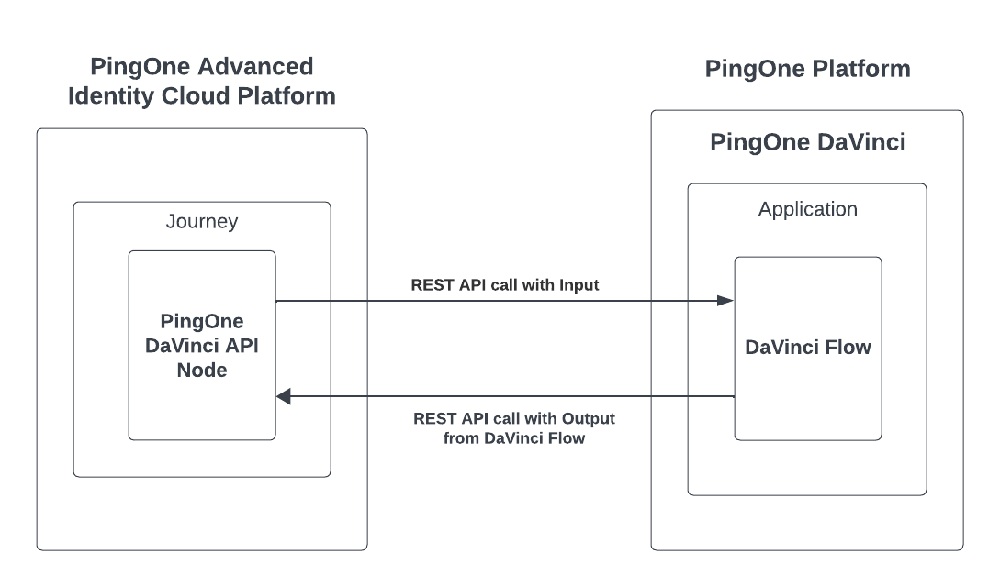

<!--
 * The contents of this file are subject to the terms of the Common Development and
 * Distribution License (the License). You may not use this file except in compliance with the
 * License.
 *
 * You can obtain a copy of the License at legal/CDDLv1.0.txt. See the License for the
 * specific language governing permission and limitations under the License.
 *
 * When distributing Covered Software, include this CDDL Header Notice in each file and include
 * the License file at legal/CDDLv1.0.txt. If applicable, add the following below the CDDL
 * Header, with the fields enclosed by brackets [] replaced by your own identifying
 * information: "Portions copyright [year] [name of copyright owner]".
 *
 * Copyright 2023 ForgeRock AS.
-->
# PingOne & PingOne DaVinci API

The following document outlines how to use the PingOne Node and the PingOne DaVinci API Node for Identity Cloud journeys.

## PingOne Node

The PingOne Node establishes trust between PingOne and Identity Cloud by leveraging a federated connection.  

This node performs an OIDC request to PingOne to delegate the user flow from Identity Cloud to PingOne using a standard OIDC redirect.  Only use this node if there is a need for PingOne to be configured as an External IdP for Identity Cloud or to execute a PingOne DaVinci flow which contains UI screens.  If that is not the case, the PingOne DaVinci API Node should be used instead.

The diagram below illustrates the integration details between PingOne Advanced Identity Cloud and the PingOne Platform.

This document contains sections on configuring the PingOne Node in Identity Cloud to integrate with the following specific PingOne Services:

* PingOne (External IdP)
* PingOne Credentials
* PingID

## Quick start with sample journeys

Identity Cloud provides sample journeys to help you understand the most common RSA SecurID use cases. To use the samples, download [the JSON files for sample journeys](https://github.com/ForgeRock/Rsa-SecurId-Auth-Tree-Nodes/tree/cloud-prep/sample) and import the downloaded sample journeys into your Identity Cloud environment.

### Dependencies

To use this node, you must have:

* A PingOne Environment
* A PingOne OIDC Application configured to your Identity Cloud instance  

## Setup

### Establishing Federation Between Identity Cloud and PingOne

#### Adding the PingOne application in the PingOne Platform

From the PingOne environment, use the Applications page to add an application to be used by Identity Cloud to connect to PingOne.

1. Go to **Applications** -> **Applications**.
2. Click the **+** icon.
3. Create the application profile by entering the following:
   * **Application name**: Identity Cloud Federation
   * **Description** (optional): Enables federation from Identity Cloud to PingOne
4. Choose the OIDC Web App for Application Type. 
5. Click Save

6. Once the Application is created, click the **Configuration** tab and then click the **Pencil** icon to edit the Application.
7. Under **PKCE Enforcement** click the drop-down and select **S256_REQUIRED**.
8. Under **Token Endpoint Authentication Method** click the drop-down and select **Client Secret Post**.
9. Next, click the **Require Pushed Authorization Request** checkbox.
10. Finally, enter the **Redirect URIs** of the ForgeRock AM instance.  
11. Click **Save** and enable the **Application** by clicking on the toggle button.

#### Configure the PingOne Node in Identity Cloud

From the Identity Cloud tenant:

1. Configure the following items in the PingOne service for Federation, refer to [PingOne Service documentation](#)

   * Region:   PingOne Region associated with your PingOne environment.
   * Environment ID: The PingOne Environment ID
   * Client ID: The Client ID of the application created in the PingOne steps above.  
   * Client Secret: The Client Secret of the application created in the PingOne steps above.
   * Redirect URI:  The Identity Cloud or Access Manager redirect URI.

2. Open the Journey or Tree where you would like to add the PingOne Node and search for the PingOne Node.  
3. Place the PingOne Node on the Journey canvas and select the node to configure the following:

   * ACR Value: The ACR value can be used to select the DaVinci flow policy to execute, if this field is not populated the Application default policy will be selected to execute.  
   * Inputs: The Inputs field is a multi-value field which is used to define the specific Node State attributes to send to PingOne.  Note, the default * will send the entire Node State of the Journey to PingOne.  

Now, the federation connection between Identity Cloud and PingOne has been completed.  The following sections will cover the integrations to the specific PingOne services.

### PingOne Federation (External IdP)

This use case would be implemented in the scenario where the customer would like to use PingOne as an External IdP for Identity Cloud.

The establishment of the federation connection between Identity Cloud and PingOne completed above covered the majority of the configuration.  The only remaining task for this use case would be to configure the following PingOne Node outcomes in the Identity Cloud Journey, see below:

### PingOne Credentials

This use case would be implemented in the scenario where the customer would like to execute the PingOne Credential flows in DaVinci from Identity Cloud, please follow the steps below to implement this use case.

1. First in PingOne DaVinci, import the PingOne Credential DaVinci flows available for [download here](#)
2. Next, create a DaVinci application as described here
3. Followed by creating a Flow Policy for the new DaVinci application as described here
4. Attached the first PingOne Credential flow to the newly created Flow Policy.  
5. Next, navigate to PingOne and select the PingOne Application created in the Federation step 1.  Click the Policies tab.
6. Next, click the Edit Policies crayon button and under the DaVinci Policies tab find and select the Flow Policy created in step 3 above.  
7. Repeat these steps for each PingOne Credentials flow.

### PingID 

This use case would be implemented in the scenario where the customer would like to execute the PingID flow in DaVinci from Identity Cloud, please follow the steps below to implement this use case.

1. First in DaVinci, import the PingID flow available for download here [TODO add link](#)

The PingID Welcome flow requires a PingOne User ID to be supplied as input to the flow.  A DaVinci Wrapper flow is available here which will retrieve the User ID from the username supplied during the federation from Identity Cloud or create a new PingOne User record if no record with the supplied username exists.

1. Import the Wrapper flow.  
2. Next, create a DaVinci application as described here
3. Followed by creating a Flow Policy for the new DaVinci application as described here
4. Attached the Wrapper flow to the newly created Flow Policy.  
5. Next, navigate to PingOne and select the PingOne Application created in the Federation step 1.  Click the Policies tab.
6. Next, click the Edit Policies crayon button and under the DaVinci Policies tab find and select the Flow Policy created in step 3 above.

Now, the PingID Welcome flow will be executed during federation from Identity Cloud.

### PingOne Authorize

TODO

# PingOne Node

The **PingOne** node enables a Trusted Federation to be established between Identity Cloud and the PingOne SSO service which can be optionally configured to trigger a PingOne DaVinci flow. 

## Compatibility

---

You can implement this node on the following systems:

| Product | Compatible |
|---------|------------|
| ForgeRock Identity Cloud | Yes |
| ForgeRock Access Management (self-managed) | Yes |
| ForgeRock Identity Platform (self-managed) | Yes |

## Inputs
The username attribute must exist in the shared node state as an input to the node.

## Configuration

### PingOne Node 
| Property                            | Usage                                                                                                                                                                                                                                                                                                                                                                                                                                                                                                                                                                                                                                                                                                                                                                                                                                                                                                                                                                                                                                            |
|-------------------------------------|--------------------------------------------------------------------------------------------------------------------------------------------------------------------------------------------------------------------------------------------------------------------------------------------------------------------------------------------------------------------------------------------------------------------------------------------------------------------------------------------------------------------------------------------------------------------------------------------------------------------------------------------------------------------------------------------------------------------------------------------------------------------------------------------------------------------------------------------------------------------------------------------------------------------------------------------------------------------------------------------------------------------------------------------------|
| ACR Value                           | An optional field which can be used to trigger a specific PingOne Application policy                                                                                                                                                                                                                                                                                                                                                                                                                                                                                                                                                                                                                                                     |
| Inputs                              | A multi-value field which can used to select specific Node State attributes to include the Federation request to PingOne.  By default the Wildcard * value will include the entire Journey Node State in the federation request to PingOne

## Outputs

---

Any claims returned by PingOne during federation will be stored in Node State.  

## Outcomes

---

***Account exists***

- If the account returned by PingOne during federation matches an existing account and is linked to the account in Identity Cloud.   

***Account exists, no link***

- If the account returned by PingOne during federation exists in Identity Cloud but it is not yet linked to the existing account in Identity Cloud.

***No account exists***

- If the account returned by PingOne during federation does not exists in Identity Cloud.

***Error***

- An error occurred causing the request to fail. Check the response code, response body, or logs to see more details of the error.

## Troubleshooting

---

If this node logs an error, review the log messages the find the reason for the error and address the issue appropriately.

## Examples

---

# PingOne DaVinci API Node

This node executes an API call to PingOne DaVinci to launch a specific DaVinci flow.  Note, as this node is using the DaVinci flow API integration method, it is only effective for DaVinci flows without a UI component.

## Quick start with sample journeys

Identity Cloud provides sample journeys to help you understand the most common RSA SecurID use cases. To use the samples, download [the JSON files for sample journeys](https://github.com/ForgeRock/Rsa-SecurId-Auth-Tree-Nodes/tree/cloud-prep/sample) and import the downloaded sample journeys into your Identity Cloud environment.

### Dependencies

To use this node, you must have:

* A PingOne Environment with PingOne DaVinci enabled
* A PingOne DaVinci application and flow policy configured to the selected PingOne DaVinci flow. 

## Setup

### Preparing the PingOne DaVinci flow

This procedure only covers the steps and nodes required to prepare a PingOne DaVinci flow for API invocation. 
It assumes that you have already created a PingOne DaVinci flow for the purpose you have in mind.

1. From within PingOne DaVinci, click the Flows tab.
2. Find the flow and click > Edit
3. At the end of the success path, add an HTTP node to send a JSON success response.
4. At the end of any failure paths, add an HTTP node to send a JSON error response.
5. Click Save.
6. Click Deploy.

### Creating a PingOne DaVinci Application

1. From within PingOne DaVinci, click the Applications tab.
2. Click Add Application.
3. The Add Application modal opens.
4. In the Name field, enter a name for the application.
5. Click Create.
6. Find the application and click Edit.
7. On the General tab, note the following parameters:
8. Note the Company ID.
9. Note the API Key.
10. Create a flow policy:
11. Click the Flow Policy tab.
12. Click + Add Flow Policy.
13. In the Name field, enter a name for the flow policy.
14. In the flow list, select your flow.
15. In the version list, select the desired flow version.
16. Click Create Flow Policy.
17. Click Save Flow Policy.
18. Note and record the Policy ID of your flow policy.

### Configure PingOne DaVinci API node in the Journey

Now, the next steps will cover how to configure the PingOne DaVinci API node in Identity Cloud.

1. From within Identity Cloud, configure the following fields in the PingOne Service, refer to [PingOne Service documentation]()
   * Environment ID
   * Environment Region
   * PingOne DaVinci API Key
   
2. Navigate to the Journey and add the PingOne Davinci API node to the Journey canvas and select it.  
3. Enter the Policy ID into the Flow Policy ID field of the node.
4. Optionally configure the specific attributes from the Node State to be sent over to PingOne Davinci by using the Input field, otherwise leave the * wildcard character to send the entire Node state to PingOne DaVinci.

The PingOne DaVinci API node has 3 outcomes, True, False and Error, configure the outcomes to the rest of the Journey as required.  Any data returned in the DaVinci success response will be available in the Identity Cloud Node State.  A scripted decision node can be used to access that data as shown below:

# PingOne DaVinci API Node

The **PingOne DaVinci API** node allows a Identity Cloud journey to trigger a PingOne DaVinci flow via the API integration method where the DaVinci flow does not render any front-end UI pages.  

## Compatibility

---

You can implement this node on the following systems:

| Product | Compatible |
|---------|------------|
| ForgeRock Identity Cloud | Yes |
| ForgeRock Access Management (self-managed) | Yes |
| ForgeRock Identity Platform (self-managed) | Yes |

## Inputs
This node does not have any required input fields.  

## Configuration

### PingOne DaVinci API Node
| Property                            | Usage                                                                                                                                                                                                                                                                                                                                                                                                                                                                                                                                                                                                                                                                                                                                                                                                                                                                                                                                                                                                                                            |
|-------------------------------------|--------------------------------------------------------------------------------------------------------------------------------------------------------------------------------------------------------------------------------------------------------------------------------------------------------------------------------------------------------------------------------------------------------------------------------------------------------------------------------------------------------------------------------------------------------------------------------------------------------------------------------------------------------------------------------------------------------------------------------------------------------------------------------------------------------------------------------------------------------------------------------------------------------------------------------------------------------------------------------------------------------------------------------------------------|
| Flow Policy ID                      | The PingOne DaVinci Flow Policy configured for the specific flow.                                                                                                                                                                                                                                                                                                                                                                                                                                                                                                                                                                                                                                                     |
| Inputs                              | A multi-value field which can used to select specific Node State attributes to include the API request to PingOne DaVinci.  By default the Wildcard * value will include the entire Journey Node State in the API request to PingOne DaVinci.

## Outputs

---
Any data configured to be returned in the PingOne DaVinci flow will be put into Node State.  

## Outcomes

---

***True***

- The PingOne DaVinci flow executed and returned a Success response.  

***False***

- The PingOne DaVinci flow executed and returned an Error response.

***Error***

- An error occurred causing the request to fail. Check the response code, response body, or logs to see more details of the error.

## Troubleshooting

---

If this node logs an error, review the log messages the find the reason for the error and address the issue appropriately. There are also many publicly accessible test endpoints which can be used to help test and troubleshoot with this node. 

## Examples