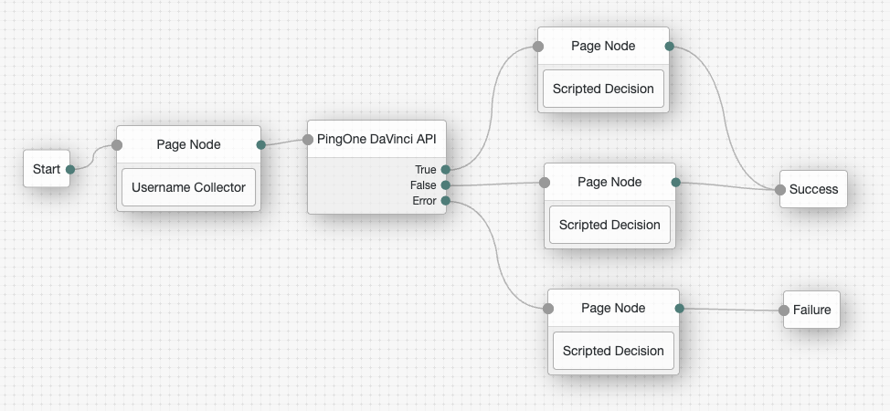

<!--
 * This code is to be used exclusively in connection with Ping Identity Corporation software or services. Ping Identity Corporation only offers such software or services to legal entities who have entered into a binding license agreement with Ping Identity Corporation.
 *
 * Copyright 2024 Ping Identity Corporation. All Rights Reserved
-->

# PingOne DaVinci API

This node executes an API call to PingOne DaVinci to launch a specific DaVinci flow.  Note, as this node is using the DaVinci flow API integration method, it is only effective for DaVinci flows without a UI component.

Identity Cloud provides the following artifacts to enable the PingOne DaVinci API node:

* [PingOne service](https://github.com/ForgeRock/tntp-ping-service/tree/cloudprep?tab=readme-ov-file#ping-one-service)
* [PingOne DaVinci API node](https://github.com/ForgeRock/tntp-pingone-davinci/blob/cloudprep/docs/pingone_davinci_api/Readme.md#pingone-davinci-api-node)

You must set up the following before using the PingOne DaVinci API node:
* [Preparing the PingOne DaVinci flow](https://github.com/ForgeRock/tntp-pingone-davinci/blob/cloudprep/docs/pingone_davinci_api/Readme.md#preparing-the-pingone-davinci-flow)
* [Configure the Input Schema](https://github.com/ForgeRock/tntp-pingone-davinci/blob/cloudprep/docs/pingone_davinci_api/Readme.md#configure-the-input-schema)
* [Creating a PingOne DaVinci Application](https://github.com/ForgeRock/tntp-pingone-davinci/blob/cloudprep/docs/pingone_davinci_api/Readme.md#creating-a-pingone-davinci-application)
* [PingOne service](https://github.com/ForgeRock/tntp-ping-service/tree/cloudprep?tab=readme-ov-file#ping-one-service)

For more information on this node, refer to PingOne DaVinci API node.

## PingOne DaVinci setup
You must set up the following before using the PingOne DaVinci API node:
* [Preparing the PingOne DaVinci flow](https://github.com/ForgeRock/tntp-pingone-davinci/blob/cloudprep/docs/pingone_davinci_api/Readme.md#preparing-the-pingone-davinci-flow)
* [Configure the Input Schema](https://github.com/ForgeRock/tntp-pingone-davinci/blob/cloudprep/docs/pingone_davinci_api/Readme.md#configure-the-input-schema)
* [Creating a PingOne DaVinci Application](https://github.com/ForgeRock/tntp-pingone-davinci/blob/cloudprep/docs/pingone_davinci_api/Readme.md#creating-a-pingone-davinci-application)
* [PingOne service](https://github.com/ForgeRock/tntp-ping-service/tree/cloudprep?tab=readme-ov-file#ping-one-service)

### Preparing the PingOne DaVinci flow
***
This procedure only covers the steps and nodes required to prepare a PingOne DaVinci flow for API invocation.
It assumes that you have already created a PingOne DaVinci flow for the purpose you have in mind.

1. From within PingOne DaVinci, click the Flows tab.
2. Find the flow and click > Edit
3. At the end of the success path, add an HTTP node to send a JSON success response.
4. At the end of any failure paths, add an HTTP node to send a JSON error response.
5. Click Save.
6. Click Deploy.

Further details [PingOne DaVinci: Configuring the Flow](https://docs.pingidentity.com/r/en-us/davinci/davinci_api_flow_launch_configuring_flow)

### Configure the Input Schema
***
The PingOne DaVinci API node will send the Journey Node State to the PingOne DaVinci flow, this Node State must be configured as an Input Parameter for the PingOne DaVinci flow.

1. Next, click on Input Schema on the DaVinci flow canvas.
2. Click Add to add an input parameter.
3. Enter **nodeState** as the parameter name.
4. Select **Object** as the parameter data type.
5. Click Save.

### Creating a PingOne DaVinci Application
***
1. From within PingOne DaVinci, click the Applications tab.
2. Click Add Application.
3. The Add Application modal opens.
4. In the Name field, enter a name for the application.
5. Click Create.
6. Find the application and click Edit.
7. On the General tab, note the following parameters:
8. Note the Company ID.
9. Note the API Key.
10. Create a flow policy:
11. Click the Flow Policy tab.
12. Click + Add Flow Policy.
13. In the Name field, enter a name for the flow policy.
14. In the flow list, select your flow.
15. In the version list, select the desired flow version.
16. Click Create Flow Policy.
17. Click Save Flow Policy.
18. Note and record the Policy ID of your flow policy.

Further details: [PingOne DaVinci: Create Application](https://docs.pingidentity.com/r/en-us/davinci/davinci_api_flow_launch_creating_application)

## PingOne DaVinci API node
The PingOne DaVinci API node will execute any DaVinci flow that does not render any UI screens.

### Compatibility
***

<table>
<colgroup>
<col>
<col>
</colgroup>
<thead>
<tr>
<th>Product</th>
<th>Compatible?</th>
</tr>
</thead>
<tbody>
<tr>
<td>
ForgeRock Identity Cloud
</td>
<td>
<i>✓</i>
</td>
</tr>
<tr>
<td>
ForgeRock Access Management (self-managed)
</td>
<td>
<i>✓</i>
</td>
</tr>
<tr>
<td>
ForgeRock Identity Platform (self-managed)
</td>
<td>
<i class="fa fa-check" title="yes">✓</i>
</td>
</tr>
</tbody>
</table>

### Inputs
***
By default any data in the node state will be sent to the PingOne DaVinci flow in the nodeState input parameter.  It is possible to filter the properties sent to PingOne DaVinci by using the Input property in the tree node configuration.

### Dependencies
***
To use this node, you must configure the PingOne service.

### Configuration
***
The configurable properties for this node are:

<table><colgroup><col><col></colgroup><thead>
						<tr>
							<th class="entry colsep-1 rowsep-1" id="jzf1692634635960__table_y2d_vml_nyb__entry__1">Property</th>
							<th class="entry colsep-1 rowsep-1" id="jzf1692634635960__table_y2d_vml_nyb__entry__2">Usage</th>
						</tr>
					</thead><tbody class="tbody">
						<tr class="row">
							<td class="entry colsep-1 rowsep-1" headers="jzf1692634635960__table_y2d_vml_nyb__entry__1">
								
PingOne Service

							</td>
							<td class="entry colsep-1 rowsep-1" headers="jzf1692634635960__table_y2d_vml_nyb__entry__2">
                The PingOne Service used for this DaVinci API Node</td>
						</tr>

<tr>
    <td>
        Flow Policy ID
    </td>
    <td>
        The PingOne DaVinci Flow Policy configured for the specific flow.
    </td>
</tr>
<tr>
    <td>
        Inputs
    </td>
    <td>
        A multi-value field which can used to select specific Node State attributes to include the API request to PingOne DaVinci.  By default the Wildcard * value will include the entire Journey Node State in the API request to PingOne DaVinci.
    </td>
</tr>

</tbody></table>

### Outputs
***
Any data configured to be returned to the PingOne DaVinci flow will be put into Node State.

## Outcomes

---

***True***

- The PingOne DaVinci flow executed and returned a Success response.

***False***

- The PingOne DaVinci flow executed and returned an Error response.

***Error***

- An error occurred causing the request to fail. Check the response code, response body, or logs to see more details of the error.

### Troubleshooting
***
If this node logs an error, review the log messages to find the reason for the error and address the issue appropriately.

### Examples
***
This example journey highlights the use of the PingOne Verify node for a Registration

